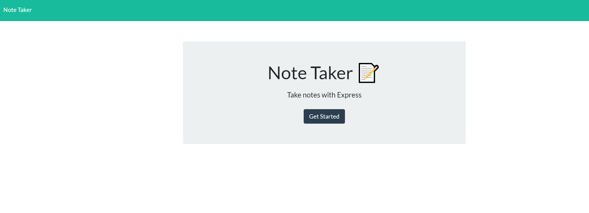
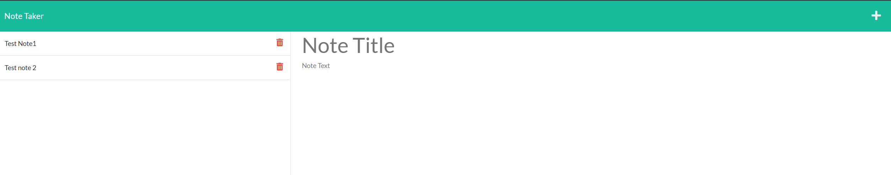

# Notes Taker  
An application to help keep your notes well organized. This app is made with node.js and express.js
## Table of Contents:
* [Installation](#installation)
* [Usage](#usage)
* [License](#license)
* [Contributing](#contributing)
* [Tests](#tests)
* [Questions](#questions)
### Installation:
To install dependencies, run the following:
```npm i express & npm i uuid```
### Usage:
Feel free to clone it down and use it, or deploy it from the live url



### License:
This project is licensed under:
none
### Contributing:
If you would like to contribute, please fork it, make your changes and add a well documented pull request
### Tests:
To run the test enter the following:
```N/A```
### Questions:
If you have any questions contact me at [GitHub](https://github.com/julioPlaceres) or contact me at jplaceresvaldes@outlook.com
    
 